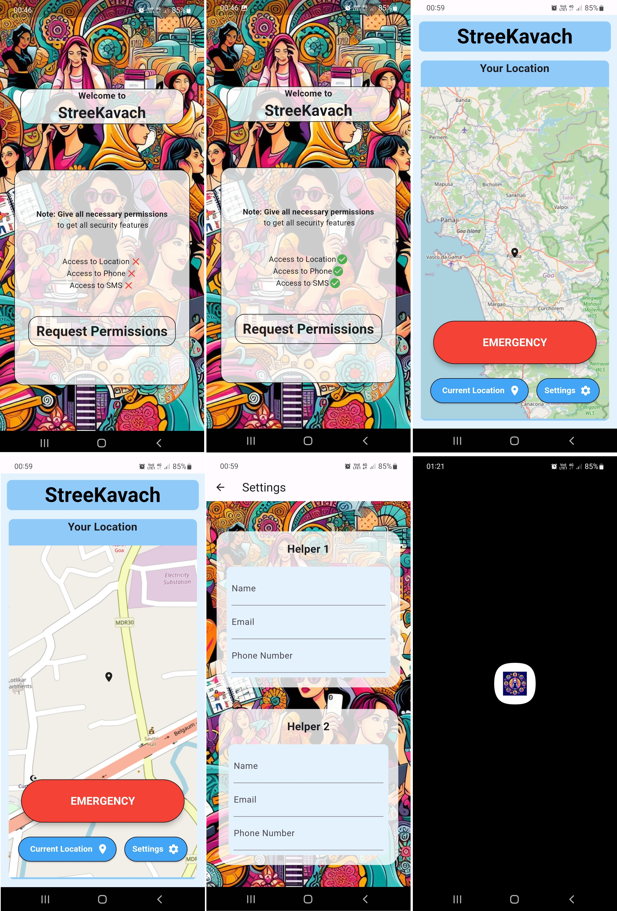

# Stree Kawach

Stree Kawach is a powerful Flutter app designed to empower and ensure the safety of women. With a range of features and functionalities, it aims to provide a sense of security and assistance in emergency situations. This README file provides an overview of the app, its features, setup instructions, and other important details.

<!-- # Screenshots

 -->

# Mockups

    
    
    
    
    

# Screen Recording
<iframe width="914" height="514" src="https://www.youtube.com/embed/12S6djBV3ng" title="StreeKavach" frameborder="0" allow="accelerometer; autoplay; clipboard-write; encrypted-media; gyroscope; picture-in-picture; web-share" allowfullscreen></iframe>

## Features

### 1. Emergency SOS
- Instantly send distress signals to emergency contacts with a single tap.
- Integrated with location tracking to provide real-time updates to contacts.
- Option to include audio and video recordings as evidence.

### 2. Location Tracking
- Continuously track the user's location and share it with trusted contacts.
- Allow contacts to view the user's location in real-time on a map.

### 3. Safe Routes
- Suggests the safest routes for traveling based on user preferences.
- Utilizes real-time crime data and crowd-sourced information to identify safe paths.

### 4. Panic Button
- Easily accessible panic button on the home screen for immediate assistance.
- Triggers emergency alerts and sends notifications to designated contacts.

### 5. Safety Tips and Resources
- Provides essential safety tips and guidelines for different scenarios.
- Access to a curated list of helpline numbers and emergency services.

### 6. Personal Guardian
- Assign trusted contacts as personal guardians for enhanced safety.
- Guardians receive alerts and notifications during emergencies.

## Installation and Setup

- Clone the repository:
git clone https://github.com/your-username/stree-kawach.git

- Navigate to the project directory:
cd stree-kawach
- Install dependencies:
flutter pub get
- Run the app:
flutter run

Please make sure you have Flutter and Dart SDK installed on your machine before running the app.

## Requirements

- Flutter SDK
- Dart SDK
- Android Studio / Xcode (for simulators or physical devices)
- Internet connectivity (for real-time location tracking and emergency notifications)

## Contributing

Contributions are welcome! If you have any ideas, bug reports, or feature requests, please open an issue or submit a pull request. Make sure to follow the code style and guidelines mentioned in the project.

## License

This project is licensed under the [MIT License](LICENSE).

## Acknowledgments

We would like to thank the open-source community for their valuable contributions and the libraries used in this project. Special thanks to [Library Name] for providing [specific functionality/library name].
